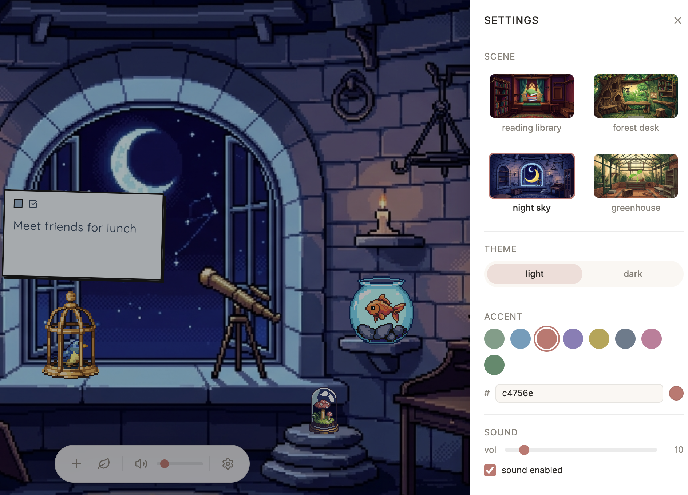
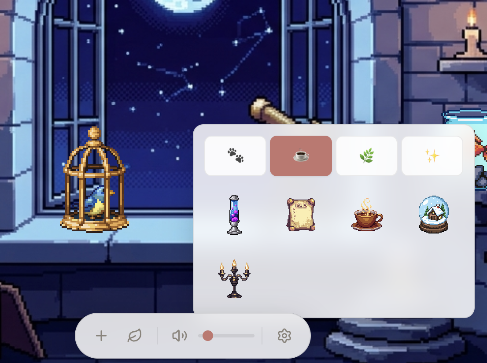

# nook

A cosy pixel art Chrome extension that turns your new tab into a calm productivity corner.


## Features

- **Sticky notes** — create, drag, resize, and colour-code freeform notes or checklists
- **4 pixel art backgrounds** — reading library, forest treehouse, astronomer's tower, Victorian greenhouse
- **20 pixel art decorations** — creatures, cosy items, plants, and magical objects
- **Ambient music** — lo-fi tracks that play softly whilst you work
- **Themes** — light and dark mode with customisable accent colours
- **Local storage** — no account needed, no data leaves your browser





## Install

Available on the [Chrome Web Store](https://chromewebstore.google.com) (search "nook").

Or load locally:

1. Clone this repo
2. `npm install && npm run build`
3. Go to `chrome://extensions`, enable Developer mode
4. Click "Load unpacked" and select the `dist/` folder
5. Open a new tab

## Development

```
npm install
npm run dev
```

Load the `dist/` folder as an unpacked extension. Changes hot-reload via CRXJS.

## Privacy

nook stores all data in your browser's local storage. No analytics, no tracking, no servers. See [privacy policy](privacy-policy.md).
